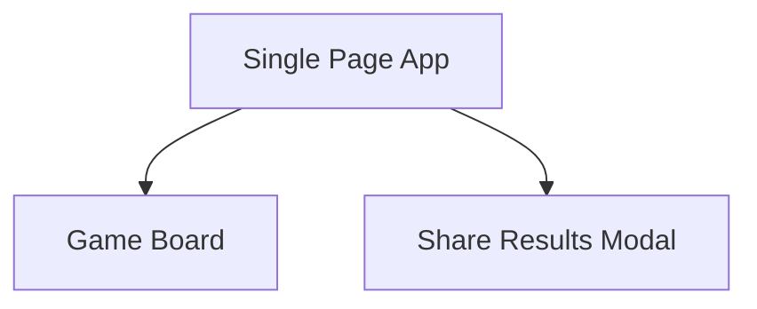
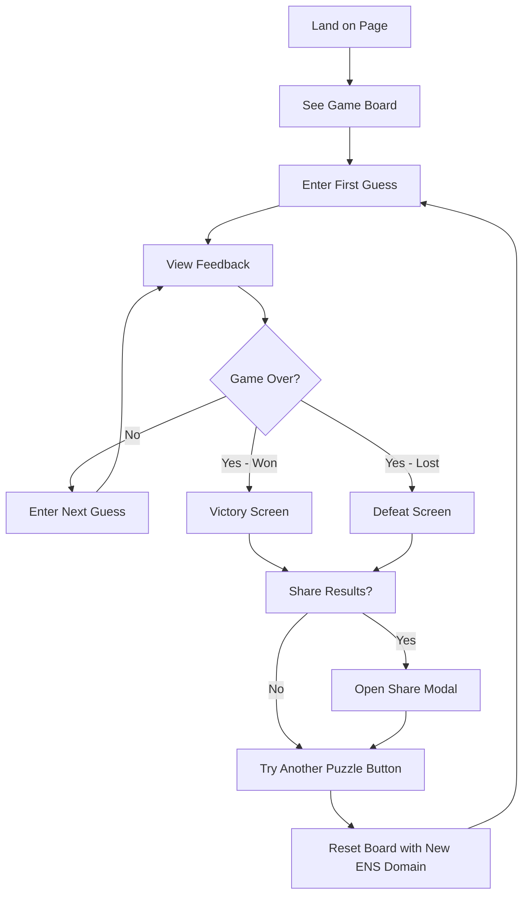

# ENS Wordle UI/UX Specification

This document defines the user experience goals, information architecture, user flows, and visual design specifications for ENS Wordle's user interface. It serves as the foundation for visual design and frontend development, ensuring a cohesive and user-centered experience.

## Information Architecture (IA) - MVP Single Page

**Simplified Site Map:**

**Navigation Structure:**
- **Primary Navigation:** None - pure single page
- **Secondary Navigation:** None needed
- **Breadcrumb Strategy:** Not applicable

**MVP Interface:**
- Game board (center focus)
- Share button/modal (only after game completion)
- Minimal, distraction-free design

## User Flows

**Primary User Flow - Game Session with New Puzzle:**

**User Goal:** Play ENS Wordle games continuously

**Entry Points:** Direct link to the single page app

**Success Criteria:** User completes games and can easily try new puzzles

**Flow Diagram:**

**Edge Cases & Error Handling:**
- Invalid word entry (not a real word/ENS domain)
- Page refresh during game (game state lost - acceptable for MVP)
- Share functionality not available (graceful degradation)
- Running out of ENS domains for new puzzles (show message)

## Wireframes & Mockups

**Key Screen Layouts:**

### Game Board (Initial State)
**Purpose:** Present a flexible grid that adapts to the ENS domain length

**Key Elements:**
- Dynamic grid: N columns (matching ENS domain length) x 6 rows
- Grid adjusts width/spacing based on domain length
- Virtual keyboard for input
- Simple header showing target length (e.g., "5 letters")
- Clean, minimal background

**Interaction Notes:** Grid size determined by the puzzle, communicated to user upfront

### Game Board (Active Play)  
**Purpose:** Show feedback with flexible letter count

**Key Elements:**
- Variable-width grid with color-coded feedback
- Current input row highlighted/active
- Used letters indicated on virtual keyboard
- Letter count indicator/validation
- Remaining guesses clear

**Interaction Notes:** Input validation ensures guess matches target length

### Game Complete (Victory/Defeat)
**Purpose:** Show results regardless of domain length

**Key Elements:**
- Completed grid (any width)
- Success/reveal message
- Share results button (shares grid pattern)
- Try another puzzle button

**Interaction Notes:** Share functionality adapts to show the variable-width result

**Design Considerations:**
- Grid centering for different lengths
- Mobile responsiveness across various widths
- Virtual keyboard layout consistency regardless of target length
- Clear communication of expected input length

## Component Library / Design System

**Design System Approach:** Create a minimal, focused component library specifically for the ENS Wordle MVP. Keep it simple and extensible for future versions.

**Core Components:**

### Game Grid
**Purpose:** Display the variable-width guessing grid with letter feedback

**Variants:** 
- Empty state (initial)
- Active state (current guess)
- Completed state (with feedback colors)

**States:** 
- Default (empty cells)
- Input (current letter entry)
- Correct (green background)
- Wrong position (yellow background)  
- Not in word (gray background)
- Revealed (game over state)

**Usage Guidelines:** Grid adapts to ENS domain length, maintains consistent spacing and visual hierarchy

### Letter Cell
**Purpose:** Individual cell within the game grid

**Variants:**
- Empty
- Filled with letter
- Different feedback states

**States:**
- Default, focused, correct, wrong-position, absent, revealed

**Usage Guidelines:** Square aspect ratio, clear typography, smooth state transitions

### Virtual Keyboard
**Purpose:** On-screen keyboard for letter input

**Variants:**
- Full alphabet layout
- Mobile-optimized layout

**States:**
- Default, used (grayed out), available
- Correct/wrong position feedback matching game grid

**Usage Guidelines:** Matches grid feedback colors, clear touch targets, users click letters to input

### Action Button
**Purpose:** Primary actions like "Try Another Puzzle" and "Share"

**Variants:**
- Primary (main actions)
- Secondary (less prominent actions)

**States:**
- Default, hover, active, disabled

**Usage Guidelines:** Clear, accessible, consistent with game aesthetic

### Share Modal
**Purpose:** Display shareable results grid

**Variants:** 
- Success share
- Failure share

**States:**
- Open, closed

**Usage Guidelines:** Simple overlay, easy copy/close functionality

## Branding & Style Guide

### Color Palette

| Color Type | Hex Code | Usage |
|------------|----------|-------|
| Primary | #6aaa64 | Correct letter position (green feedback) |
| Secondary | #c9b458 | Wrong position (yellow feedback) |
| Accent | #787c7e | Absent letters (gray feedback) |
| Success | #6aaa64 | Game completion, positive feedback |
| Warning | #c9b458 | Input validation, hints |
| Error | #f5793a | Invalid inputs, error states |
| Neutral | #121213, #ffffff, #d3d6da | Text, borders, backgrounds, grid lines |

### Typography

**Font Families:**
- **Primary:** -apple-system, BlinkMacSystemFont, 'Segoe UI', system fonts
- **Secondary:** Same (keeping it simple for MVP)
- **Monospace:** 'Courier New', monospace (if needed for sharing/results)

**Type Scale:**

| Element | Size | Weight | Line Height |
|---------|------|--------|-------------|
| H1 | 24px | 600 | 1.2 |
| H2 | 20px | 500 | 1.3 |
| H3 | 18px | 500 | 1.4 |
| Body | 16px | 400 | 1.5 |
| Small | 14px | 400 | 1.4 |

### Iconography
**Icon Library:** Minimal SVG icons or Unicode symbols for basic UI elements

**Usage Guidelines:** Keep icons simple, functional, and consistent with clean game aesthetic

### Spacing & Layout
**Grid System:** CSS Grid for game board, flexbox for other layouts

**Spacing Scale:** 4px, 8px, 16px, 24px, 32px (consistent spacing units)

## Accessibility Requirements

**Compliance Target:**
**Standard:** WCAG 2.1 AA compliance as baseline, with specific attention to game accessibility

### Key Requirements

**Visual:**
- Color contrast ratios: 4.5:1 minimum for text, 3:1 for UI components
- Focus indicators: Clear, visible focus rings on virtual keyboard buttons
- Text sizing: Supports browser zoom up to 200% without horizontal scrolling

**Interaction:**
- Keyboard navigation: Tab cycles through virtual keyboard buttons, Enter/Space activates
- Screen reader support: Virtual keyboard buttons properly labeled
- Touch targets: Minimum 44px touch targets for virtual keyboard buttons

**Content:**
- Alternative text: Virtual keyboard button states communicated to screen readers
- Heading structure: Logical heading hierarchy for page structure
- Form labels: Virtual keyboard buttons clearly labeled with letters

### Game-Specific Accessibility

**Virtual Keyboard Focus:**
- Clear visual focus indicators on keyboard buttons
- Tab order through letter buttons (A-Z)
- Enter/Space activates focused letter button

**Screen Reader Experience:**
- Virtual keyboard buttons announce letter and state (available/used/correct/wrong position)
- Grid state announced after each guess
- Game progress and remaining attempts announced

### Testing Strategy
- Automated accessibility scanning
- Manual tab navigation testing
- Screen reader testing
- Color contrast validation
- Mobile touch target testing

## Responsiveness Strategy

### Breakpoints

| Breakpoint | Min Width | Max Width | Target Devices |
|------------|-----------|-----------|----------------|
| Mobile | 320px | 767px | Phones, small tablets |
| Tablet | 768px | 1023px | Tablets, small laptops |
| Desktop | 1024px | 1439px | Laptops, desktop monitors |
| Wide | 1440px | - | Large desktop monitors |

### Adaptation Patterns

**Layout Changes:** 
- Mobile: Stacked layout, full-width game grid with optimized spacing
- Tablet/Desktop: Centered layout with max-width constraints
- Grid scales proportionally while maintaining legibility

**Navigation Changes:** 
- No navigation to adapt (single page)
- Virtual keyboard optimizes button size per breakpoint

**Content Priority:** 
- Mobile: Game grid takes priority, minimal surrounding elements
- Desktop: More breathing room, larger virtual keyboard
- Share modal adapts to screen size

**Interaction Changes:** 
- Mobile: Touch-optimized virtual keyboard with larger buttons
- Desktop: Hover states on virtual keyboard buttons
- Grid cells adapt size but maintain touch-friendly targets

**Variable-Width Grid Considerations:**
- Short ENS names (3-4 letters): Comfortable on all screen sizes
- Long ENS names (8+ letters): May require horizontal scrolling on small screens or smaller cell sizes
- Dynamic font sizing within cells based on grid width and screen size

## Animation & Micro-interactions

### Motion Principles
- **Purposeful**: Every animation serves a functional purpose (feedback, state change, guidance)
- **Fast and subtle**: Quick animations that don't slow down gameplay
- **Accessible**: Respects user preferences for reduced motion
- **Battery conscious**: Efficient animations that don't drain mobile batteries

### Key Animations

- **Letter Entry Animation:** Smooth scale/pop when letter appears in grid cell (Duration: 150ms, Easing: ease-out)
- **Guess Submission:** Sequential reveal of feedback colors from left to right (Duration: 300ms per cell, Easing: ease-in-out)
- **Invalid Word Shake:** Grid row shakes horizontally to indicate invalid input (Duration: 400ms, Easing: ease-in-out)
- **Virtual Keyboard Feedback:** Button press animation with color change matching grid feedback (Duration: 100ms, Easing: ease-out)
- **Game Completion:** Subtle celebration animation for win state, gentle reveal for loss (Duration: 500ms, Easing: ease-out)
- **Try Another Puzzle:** Grid clear animation with fade-out/fade-in transition (Duration: 300ms, Easing: ease-in-out)
- **Share Modal:** Modal slides up from bottom on mobile, fades in on desktop (Duration: 250ms, Easing: ease-out)

## Performance Considerations

### Performance Goals
- **Page Load:** < 2 seconds for initial load on 3G connection
- **Interaction Response:** < 100ms response to virtual keyboard taps and letter input
- **Animation FPS:** Maintain 60fps for all animations, graceful degradation to 30fps on older devices

### Design Strategies

**Optimized Assets:**
- Minimal CSS and JavaScript bundle size
- SVG icons over bitmap images where possible  
- System fonts to avoid web font loading delays
- Inline critical CSS for immediate rendering

**Efficient Game Logic:**
- Local state management (no API calls during gameplay)
- Lightweight ENS domain validation
- Optimized grid re-rendering on guess submission

**Responsive Performance:**
- CSS Grid and Flexbox for efficient layouts
- Hardware-accelerated animations (transform, opacity)
- Lazy loading of non-critical features (share modal)
- Debounced input handling

**Mobile Optimization:**
- Touch event optimization for virtual keyboard
- Minimal DOM manipulation during active gameplay
- Battery-conscious animation timing
- Viewport meta tag for proper mobile rendering

**Caching Strategy:**
- Service worker for offline gameplay capability
- Cache ENS domain list for instant puzzle generation
- Static asset caching for repeat visits

## Next Steps

### Immediate Actions
1. Review this specification with stakeholders to confirm MVP scope and priorities
2. Set up development environment and choose tech stack (React, Vue, vanilla JS, etc.)
3. Create basic project structure and implement core game grid component
4. Build virtual keyboard component with proper accessibility
5. Implement game logic for variable-length ENS domain validation
6. Add animation and micro-interaction polish
7. Test across target devices and screen sizes

### Design Handoff Checklist

- [x] All user flows documented
- [x] Component inventory complete  
- [x] Accessibility requirements defined
- [x] Responsive strategy clear
- [x] Brand guidelines incorporated
- [x] Performance goals established

**Additional Considerations for Handoff:**
- ENS domain source/database selection
- Hosting and deployment strategy
- Analytics implementation (if needed)
- Social sharing implementation details

**Future Version Features to Consider:**
- Game statistics and history tracking
- Daily puzzle mode
- Difficulty levels (domain length ranges)
- Social features and leaderboards